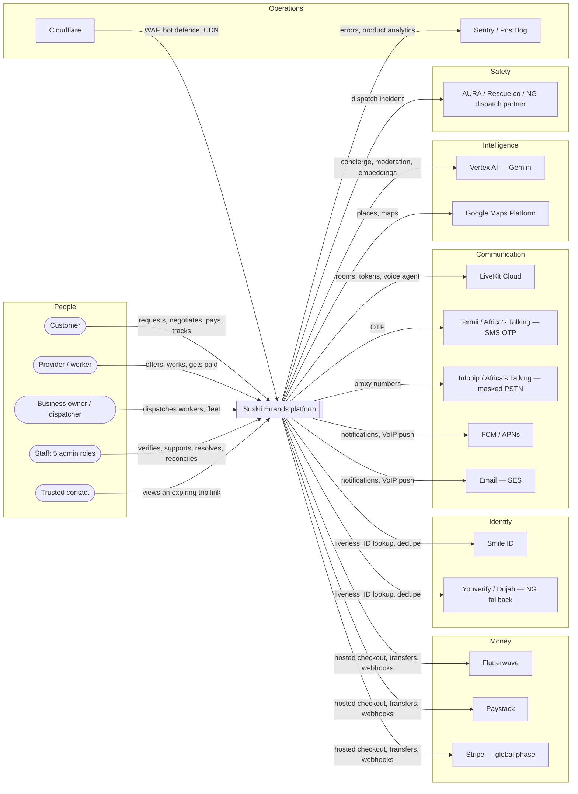
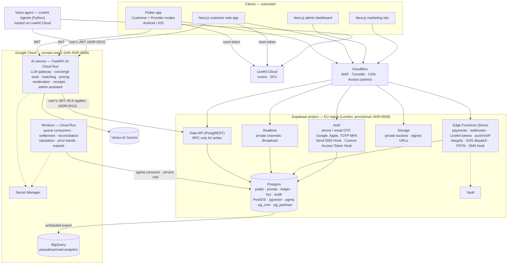
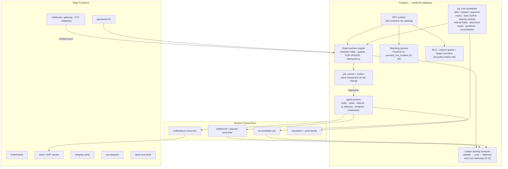

# Architecture — C4 views

| | |
|---|---|
| Owner | Claude Code |
| Date | 2026-09-16 |
| Status | Phase 1 draft |
| Evidence | Spec `architecture`; Phase 0 REPORT §6, §9, §10; ADR-0002, 0006, 0008, 0009, 0011, [0012](../adr/0012-ai-tools-act-as-user.md) |
| Companions | [threat-model.md](threat-model.md) (uses these component boundaries), [data-flow.md](data-flow.md) (uses these trust boundaries) |

Three levels: who uses the system and what it depends on (context), the deployable pieces (containers), and the inside of the backend (components). Diagrams are Mermaid flowcharts rather than Mermaid's experimental C4 syntax, because flowcharts render reliably on GitHub.

## Level 1 — System context

Wave-1 routing per country lives in the country packs (ADR-0001); Stripe carries no African traffic (OD-11).

## Level 2 — Containers

### Container responsibilities

| Container | Owns | Does **not** own |
|---|---|---|
| **Flutter app / web apps** | Rendering server state; collecting input; device signals (integrity tokens, RASP, mock-location flags); broadcasting live location during a job | Any price, fee, payout, status or verification decision |
| **Cloudflare** | WAF, bot management, rate limiting at the edge, Turnstile CAPTCHA, CDN for marketing; **Cloudflare Access (zero trust) in front of the admin dashboard** | Authorisation — that is always the database |
| **Supabase Auth** | Sessions, OTP (via the Send SMS Hook to regional SMS providers), social login, TOTP MFA; the Custom Access Token Hook adds `admin_roles` and mode claims | Trusting its own claims for sensitive data — functions re-check the database (RLS matrix) |
| **Data API** | Reads under RLS; **writes only through RPC functions** for anything in the RLS matrix marked F | Direct writes to state, money or verification columns |
| **Realtime** | Private channels authorised by RLS on `realtime.messages`; Broadcast for live location (ADR-0009) | Persistence — sampled location goes to `location_samples` via RPC |
| **Storage** | Private buckets, signed upload/download URLs, size and type limits | Serving KYC documents to anyone but audited officers |
| **Edge Functions** | Synchronous HTTP work: payment initialisation, webhook intake (verify, store raw, de-duplicate), LiveKit token minting, push and VoIP sending, integrity-token verification, SOS partner dispatch, PSTN fallback, Send SMS Hook | Anything long-running. The limits are a 2 s CPU budget and a 400 s wall clock per request (REPORT §10) |
| **Postgres** | The source of truth: state machines, ledger, RLS, outbox, queues (pgmq), schedules (pg_cron), partitions | Calling third parties itself |
| **AI service** | The LLM gateway (model routing from remote config, ADR-0006), concierge tools, matching score, price bands, moderation, receipt reading, admin assistant | Moving money, approving verification, setting prices, resolving disputes (spec guardrails) |
| **Workers** | pgmq consumers: notifications fan-out, settlement and payouts, referral accrual, reconciliation, reputation recompute, price-band training export | Serving user requests |
| **Voice agent** | Real-time voice concierge (Gemini Live, or the cascade per OD-17) | Anything the text concierge may not do — it calls the same tools |
| **BigQuery** | Analytics and model training on pseudonymised exports | Operational reads |

## Level 3 — Backend components

### Decisions this view fixes

| # | Decision | Why |
|---|---|---|
| 1 | **Writes are RPC functions, never table writes**, for everything state- or money-bearing | Spec backend rule 1; S-13 showed column grants plus functions are what actually hold |
| 2 | **Every state change writes `job_events` + `outbox` in the same transaction**; a dispatcher moves outbox rows to pgmq | Side effects (notifications, settlement, referral) can never fire for a transition that rolled back, and never get lost for one that committed |
| 3 | **Timeouts are pg_cron jobs calling the same state-machine functions** a user would | One code path per transition; a scheduled expiry obeys the same guards and emits the same events |
| 4 | **Edge Functions do synchronous HTTP; Cloud Run workers consume queues** | Edge Function CPU and wall-clock limits rule out long-running consumers |
| 5 | **Webhooks only ever call the state machine after verification** — signature, raw storage, de-duplication, then a server-side verify call to the gateway | The only path into `PAID_HELD` (job lifecycle #8) |
| 6 | **The AI service and voice agent act with the end user's JWT, not the service role** | Tools inherit RLS: a prompt-injected concierge still cannot touch another user's data. [ADR-0012](../adr/0012-ai-tools-act-as-user.md) |
| 7 | **Clients reach the AI service directly with their JWT**, which the service verifies against Supabase's JWKS | Avoids an extra hop through an Edge Function on a latency-sensitive path (~150 ms RTT, S-01) |
| 8 | **Card data never touches our infrastructure**; payment is a hosted checkout opened from the app | PCI DSS scope minimisation (SAQ-A target); ADR-0010 rejects the native Flutterwave SDK anyway |

## Deployment and regions

| Piece | Region | Basis |
|---|---|---|
| Supabase (dev, staging, prod as separate projects) | EU, London provisional | ADR-0008, pending S-01 |
| Cloud Run AI service + workers | `europe-west2` (London) — co-located with the database | Round trips between them must be intra-region |
| Vertex AI | `europe-west2` if the chosen models are served there; otherwise the nearest EU region | S-07 blocked on billing — availability unverified [A] |
| BigQuery | EU multi-region | Residency (OD-15) |
| LiveKit Cloud | Region-pinned to EU where possible; African edge quality unverified | S-01 [A] |
| Cloudflare | Global edge | — |

Separate Supabase projects per environment and migrations only through the Supabase CLI (spec). No seed data in production.

## Scale-out path (spec: document before launch)

| Pressure | First move | Next move |
|---|---|---|
| Nearest-provider query | Movement-gated heartbeats, fillfactor, autovacuum tuning (S-06: ~8–10× headroom at 1M MAU write rate) | Move `provider_live_location` to a dedicated service or Redis-geo only if dead-tuple churn outpaces autovacuum |
| Realtime connections (>10k peak) | Enterprise quota (cost model: ~60k at 1M MAU) | Self-hosted Realtime cluster |
| Read load | Read replica for the AI Admin Assistant and analytics reads | Geo-routed replicas |
| Write load on messages/events | Monthly partitions already in the ERD | Move chat to a dedicated service |
| Cross-region latency | Measure (S-01) | Self-hosted Supabase in Africa, costed as the OD-15 fallback |
