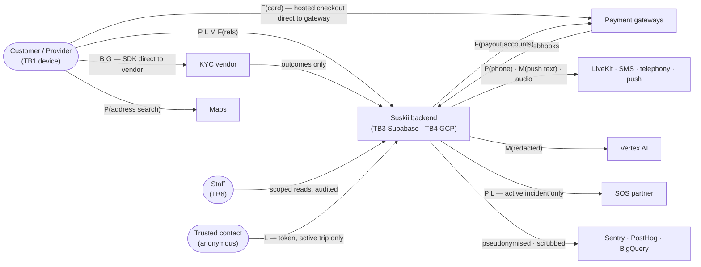

# Data-flow diagram and data classification

| | |
|---|---|
| Owner | Claude Code |
| Date | 2026-09-16 |
| Status | Phase 1 draft — feeds the DPIA (`docs/research/compliance-checklist-and-dpia.md` §4) |
| Inputs | [architecture-c4.md](architecture-c4.md) (trust boundaries), [erd.md](erd.md) (where data rests), [threat-model.md](threat-model.md) |

The spec asks for a data-flow diagram marking personal, biometric, criminal-record and financial data. This document adds location, which the threat model ranks third by harm, and government identifiers, which carry their own uniqueness constraints in the ERD.

## Data classes

| Tag | Class | Examples | Sensitivity | Rule |
|---|---|---|---|---|
| **P** | Personal | Name, phone, email, avatar, device ids, IP | Standard | Minimise; redact from logs, analytics and LLM prompts |
| **G** | Government identifier | NIN, BVN, Ghana Card, SA ID number, passport number | High | Encrypted with blind index (ADR-0007); never returned to clients after submission |
| **B** | Biometric | Selfie and liveness frames, face templates | **Special** | Explicit separate consent; **never stored by Suskii** — captured by the vendor SDK and held vendor-side; we keep job ids and outcomes only |
| **C** | Criminal record | Police-clearance documents and certificate numbers | **Special** | Explicit separate consent; upload-only bucket; officer access audited; **no free-text criminal-history notes anywhere** (spec) |
| **F** | Financial | Payment references, payout accounts, ledger, withdrawals | High | Card data never touches Suskii (hosted checkout); payout accounts encrypted with blind index |
| **L** | Location | Live pings, trip trails, saved places, access notes | High | Live pings never persisted; samples kept 90 days; access notes encrypted and revealed only during an active job |
| **M** | Content | Chat, voice notes, proof photos, AI transcripts | Medium–High | Job-scoped; moderated; AI transcripts stored redacted only |

## Trust boundaries

| # | Boundary | Inside | Crossing it requires |
|---|---|---|---|
| TB1 | **Device** | App, local store, vendor SDKs | TLS with pinning; integrity token for sensitive actions |
| TB2 | **Edge** | Cloudflare | WAF, rate limits, Turnstile |
| TB3 | **Supabase project** (EU) | Auth, API, Realtime, Storage, Edge Functions, Postgres | JWT; RLS; column grants |
| TB4 | **GCP project** (EU) | AI service, workers, BigQuery, Secret Manager | JWT verified against JWKS (ADR-0012); workload identity |
| TB5 | **Third-party processors** | Gateways, KYC vendor, LiveKit, SMS/telephony, push, maps, LLM, SOS partners, observability | DPA; minimum data; signed webhooks |
| TB6 | **Staff** | Admin dashboard users | Cloudflare Access, SSO, MFA (`aal2`), role scopes, audit |

## Level 0 — context flows

Two design choices in this diagram do most of the privacy work:

1. **Biometric data goes from the device straight to the KYC vendor.** It never crosses TB3. Suskii receives only job ids, outcomes and reason keys.
2. **Card data goes from the device straight to the gateway's hosted checkout.** It never crosses TB3, which keeps PCI scope to SAQ-A.

## Level 1 — flows in detail

| # | Flow | From → To | Classes | Protection in transit | Rests at | Retention |
|---|---|---|---|---|---|---|
| 1 | Sign-in OTP | App → Auth → SMS hook → SMS vendor → phone | P | TLS; hook signed (Standard Webhooks) | `auth.users` | Life of account |
| 2 | Customer facial verification | App (vendor SDK) → KYC vendor | **B**, G | Vendor SDK TLS | **Vendor only** | Vendor contract; deletion on closure |
| 3 | Verification outcome | KYC vendor → webhook Edge Function → `kyc.verification_sessions` | outcome, reason key | Signed webhook | `kyc` schema | Life of account + 5 years |
| 4 | Government ID submission | App → `submit_kyc_step` → `kyc.identity_documents` | **G** | TLS pinned; encrypted at rest with blind index | `kyc` schema | Life of account + 5 years |
| 5 | Police clearance upload | App → signed upload URL → `kyc-docs` bucket; metadata → `kyc.police_clearances` | **C**, G | Signed URL, write-only | `kyc-docs` bucket | 5 years after closure |
| 6 | Officer review | Staff → `get_document_url` → ≤5-min signed URL → browser | **C**, B-derived, G | TB6 controls; every view writes `audit.kyc_access` | Not copied | — |
| 7 | Request creation | App → `requests` (+ media to `request-media`) | P, L, M | TLS pinned | `public` | Financial record rules once paid |
| 8 | Access note | App → `requests.access_note_ciphertext`; revealed to assigned provider via `reveal_access_note` | **L** | Encrypted at rest; function-gated | `public` (ciphertext) | Deleted at job close |
| 9 | Offers and negotiation | App ↔ RPC; realtime per-thread channels | F (amounts), M | Private channels | `public` | 7 years (financial) |
| 10 | Card payment | App → gateway hosted checkout | **F (PAN)** | Gateway TLS; **never Suskii** | Gateway | Gateway |
| 11 | Payment confirmation | Gateway → webhook Edge Function → `webhook_events`, `payments`, ledger | F (refs, fees) | Signature + server verify | `public`, `ledger` | 7 years |
| 12 | Live tracking | Provider app → Realtime Broadcast → customer app | **L** | Private job channel | **Not persisted** | — |
| 13 | Trip trail | Provider app → `record_location_sample` → `location_samples` | **L** | TLS pinned | Partitioned table | 90 days (dispute hold copies out) |
| 14 | Trip share | Trusted contact → `get_shared_trip(token)` | **L** | Hashed expiring token | — | Link expiry |
| 15 | Chat | App → `send_message` (moderation first) → `messages`; images → `chat-media` | M, P | TLS pinned; private channel | Partitioned table | 12 months |
| 16 | In-app call | App ↔ LiveKit Cloud (room token from Edge Function) | audio | DTLS-SRTP; **no recording** | Metadata only in `calls` | 12 months |
| 17 | PSTN fallback | Edge Function → telephony vendor → both phones | P (phone numbers) | Proxy numbers | Vendor call records | Vendor contract |
| 18 | Push notification | Worker → FCM/APNs → device | P, M | Vendor TLS | Google/Apple transit | — |
| 19 | AI concierge (text) | App → AI service → Vertex Gemini | M (**redacted**), P minimised | JWT (ADR-0012); TLS | `ai_messages` redacted | 90 days |
| 20 | AI concierge (voice) | App → LiveKit → voice agent → Gemini Live | audio, M | DTLS-SRTP; TLS | Redacted transcript only | 90 days |
| 21 | Address search | App → Google Places | P, L (query text) | Vendor TLS | Google | Google terms |
| 22 | Payout | Worker → gateway transfer API | **F** (payout account) | TLS; secrets in Secret Manager | Gateway | 7 years (ledger) |
| 23 | SOS | App → `raise_sos` → Edge Function → partner API; ops console | P, **L** | Signed partner API | `sos_incidents` | Incident record retention |
| 24 | Analytics export | Postgres → BigQuery | pseudonymised | Scheduled job; EU dataset | BigQuery | Per table |
| 25 | Product analytics | App → PostHog (EU) | event names, pseudonymous id | TLS | PostHog | Vendor contract |
| 26 | Crash reports | App / services → Sentry | stack traces, **scrubbed** | TLS | Sentry | Vendor contract |

## Rules the flows impose on the build

| Rule | Flows | Owner |
|---|---|---|
| **Push payloads carry no message bodies, addresses or amounts** — only a notification id; the app fetches content after unlocking | 18 | Kimi Code + Claude Code |
| **KYC captures are never cached on the device** after upload | 2, 4, 5 | Kimi Code |
| **Nothing in flows 2, 4, 5, 22 appears in Sentry, PostHog or logs** — scrubbing rules tested, not assumed | 25, 26 | Both |
| **Redaction runs before every LLM call**, and the redacted form is what gets stored | 19, 20 | Claude Code |
| **Address search queries are not logged by Suskii** | 21 | Both |
| **Live location is never written by the tracking path** — only the sampled RPC persists points | 12, 13 | Both |
| **Staff reads leave an audit row** for classes B, C, G and L | 6, 23 | Claude Code |

The first rule is a UI change for Kimi: push payloads transit Google and Apple, so a message preview in a notification leaks conversation content to a third party. Logged in the draft review and `HANDOFF.md`.

## Cross-border transfers

Hosting is in the EU; users are in Africa. Every row below is a transfer the DPIA must give a lawful basis for, per country (OD-15, compliance checklist D7).

| Processor | Data classes | Processing location | Status |
|---|---|---|---|
| Supabase | all classes at rest | EU (London provisional) | ADR-0008, pending S-01 |
| Google Cloud (Cloud Run, BigQuery, Vertex AI) | M, P, pseudonymised analytics | EU (`europe-west2`) | Vertex regional availability unverified — S-07 blocked on billing [A] |
| Smile ID | **B**, G | Vendor-stated locations | **Unverified [A]** — contract question (vendor matrix §4) |
| Flutterwave / Paystack | F | Per country and vendor | Unverified [A] — merchant agreement |
| LiveKit Cloud | audio (transient) | Region-pinned where possible | Unverified [A] |
| Termii / Africa's Talking / Infobip | P (phone numbers) | Vendor locations | Unverified [A] |
| FCM / APNs | P, M (minimised by the push rule above) | Google / Apple global | Standard terms |
| Google Maps Platform | P, L (queries) | Google global | Standard terms |
| AURA / Rescue.co / NG partner | P, L | In country | Contract pending |
| Sentry, PostHog | scrubbed / pseudonymous | EU hosting options | Choose EU regions at setup |

5 rows above carry an `[A]`. Each becomes a contract or spike question before its data class flows in production, and each is tracked in the compliance checklist D6 (processor DPAs).
