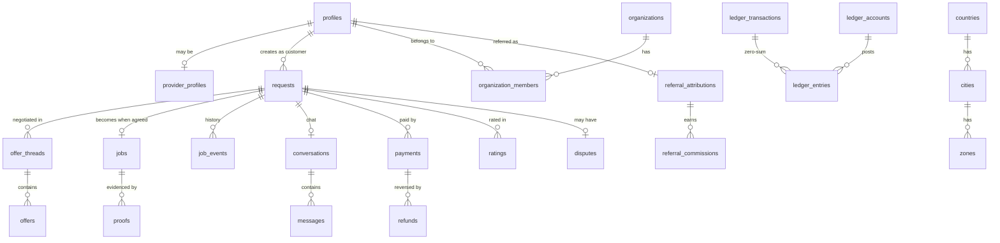

# Entity-relationship design

| | |
|---|---|
| Owner | Claude Code |
| Date | 2026-09-16 |
| Status | Phase 1 draft — becomes Phase 2 migrations; `db-types` in contracts v1 are generated from it |
| Evidence | Spikes [S-06](../research/spikes/S-06-results.md) (geo + hot table), [S-10](../research/spikes/S-10-results.md) (concurrency), [S-13](../research/spikes/S-13-results.md) (access), [S-14](../research/spikes/S-14-results.md) (money); ADR-0002, 0003, 0007, 0009 |
| Companion | [rls-policy-matrix.md](rls-policy-matrix.md), [state-machines/](state-machines/) |

This is a design document, not DDL. It fixes tables, keys, constraints, indexes, partitioning and schema placement. Column types are named precisely where a wrong choice would be expensive to reverse (money, ids, geography, encryption); obvious columns are elided.

## Conventions

| Topic | Rule | Why |
|---|---|---|
| **Schemas** | `public` — exposed through the Data API, RLS on every table. `private` — internal functions, outbox, idempotency. `ledger`, `kyc`, `audit` — **not exposed**; reachable only through vetted `SECURITY DEFINER` functions | Spec `architecture.components.schemas`. A table that is never exposed cannot be misconfigured into exposure |
| **Primary keys** | `uuid` (`gen_random_uuid()`) for entities referenced by clients. `bigint GENERATED ALWAYS AS IDENTITY` for high-volume append-only rows (messages, events, samples, ledger entries, audit) | Random UUIDs scatter B-tree inserts; identity keeps append-heavy indexes compact. Clients never need to guess or construct append-only ids |
| **Money** | `*_minor bigint NOT NULL` + `currency char(3) REFERENCES currencies(code)`. Never `numeric` for stored amounts, never floating point | Spec `money_rules`; S-14 |
| **Rates** | `*_bps integer` (basis points: 1250 = 12.5%) | Matches Kimi's `commissionRateBps`; integer, so no rounding on storage. Rounding happens once, via `round_half_even`, when an amount is computed |
| **Rounding** | Database function `round_half_even()`, never the built-in `round()` | S-14: built-in is half-away-from-zero, which drifts the ledger |
| **Time** | `timestamptz` everywhere; `created_at` default `now()`. Dates without time (certificate issue/expiry) are `date` | |
| **Geography** | `geography(Point, 4326)` for points, `geography(MultiPolygon, 4326)` for zones | Metres by default; S-06 benchmarked this type |
| **Enums** | Postgres enum types for stable state sets; **wire values are `snake_case`** (`offers_received`) and the Dart models map them | Postgres and Supabase-generated types use snake_case. Kimi's Dart enums are camelCase, so they need `@JsonValue` mapping — logged as a UI change |
| **Encrypted fields** | `*_ciphertext bytea` + `*_key_version smallint` + `*_blind_index bytea` (keyed HMAC) where lookup is needed | ADR-0007 — envelope encryption in the application layer, no pgsodium |
| **Deletion** | No soft-delete flags on business rows. Account deletion anonymises personal fields and keeps financial and audit rows (legal hold) | DPIA retention schedule |
| **Concurrency** | Aggregate rows carry `version integer`; transitions lock with `FOR UPDATE` | S-10 |
| **Writes from clients** | Only the columns granted in the RLS matrix. Status, money, verification, ratings aggregates: never | S-13 |

## Domain map

The request is the aggregate root for the whole lifecycle: `requests.status` is the single status column (a `job_status` enum with the spec's 20 values). `jobs` is a 1:1 extension created at `agreed`, holding execution and the money snapshot. This matches Kimi's `JobRequest` entity, which carries `JobStatus` from `draft` onwards.

---

## 1. Reference and configuration — `public`

| Table | Key columns | Constraints and indexes |
|---|---|---|
| `currencies` | `code char(3) PK`, `exponent smallint`, `name` | `CHECK (exponent BETWEEN 0 AND 4)`. Seeded: NGN 2, KES 2, GHS 2, ZAR 2, USD 2, **UGX 0** |
| `countries` | `code char(2) PK`, `status country_status` (`disabled`/`beta`/`live`), `currency_code`, `default_language`, `commission_rate_bps`, `referral_rate_bps`, `config jsonb`, `version integer`, `approved_by`, `approved_at` | `config` validated against a JSON Schema in a trigger (`pg_jsonschema`). Changing `status` or rates requires a four-eyes approval row. The **client-safe subset** is served by `get_bootstrap()`, never by selecting this table |
| `cities` | `id uuid PK`, `country_code`, `code`, `name`, `timezone`, `center geography(Point)` | `UNIQUE (country_code, code)` |
| `zones` | `id uuid PK`, `city_id`, `code`, `boundary geography(MultiPolygon)`, `allowed_vehicle_types vehicle_type[]` | GiST on `boundary`. Used for the Lagos okada/keke restrictions |
| `service_categories` | `id uuid PK`, `parent_id`, `key`, `name_key`, `requires_vehicle boolean`, `proof_requirements jsonb`, `offer_ttl_seconds`, `max_counter_rounds`, `embedding vector(768)` | HNSW index on `embedding` (pgvector). Dimension fixed per embedding model; a model change means a re-embed migration (ADR-0006) |
| `category_country_settings` | `(category_id, country_code) PK`, `enabled`, `soft_min_minor`, `soft_max_minor`, `hard_max_minor` | `CHECK (soft_min_minor <= soft_max_minor AND soft_max_minor <= hard_max_minor)` |
| `feature_flags` | `key`, `country_code` (null = global), `enabled`, `rollout_pct`, `payload jsonb` | `UNIQUE (key, country_code)` |
| `legal_documents` | `id uuid PK`, `country_code`, `type`, `version`, `locale`, `url`, `published_at` | `UNIQUE (country_code, type, version, locale)` |
| `prohibited_items` | `country_code`, `key`, `match_terms text[]` | Feeds rule-based moderation before any LLM call |
| `price_bands` | `(category_id, city_id, currency) PK`, `p25_minor`, `p50_minor`, `p75_minor`, `sample_size`, `computed_at` | Written by the pricing job only. **Advisory**: the spec forbids AI setting prices |

## 2. Identity, preferences and relationships — `public`

| Table | Key columns | Constraints and indexes |
|---|---|---|
| `profiles` | `user_id uuid PK → auth.users`, `display_name`, `country_code`, `language`, `active_mode user_mode`, `avatar_path`, **`customer_verification verification_status`**, **`provider_verification verification_status`**, **`trust_level trust_level`**, `created_at`, `updated_at` | Bold columns are server-owned; clients may update only `display_name`, `language`, `avatar_path` (S-13 finding 1). `active_mode` changes through `set_active_mode()`, which checks provider verification |
| `user_devices` | `id uuid PK`, `user_id`, `platform`, `device_fingerprint_hash bytea`, `push_token`, `voip_token`, `app_version`, `integrity_verdict jsonb`, `rasp_signals jsonb`, `last_seen_at` | Index on `device_fingerprint_hash` — used by self-dealing and referral de-duplication |
| `consents` | `id bigint PK`, `user_id`, `kind consent_kind` (`biometric`, `criminal_record_check`, `location`, `marketing`, `voice_processing`), `legal_document_id`, `granted boolean`, `recorded_at`, `device_id` | **Append-only**: a withdrawal is a new row with `granted = false`. Current state is the latest row per `(user_id, kind)`. Kimi's M2 draft already demands separate biometric and criminal-record consents |
| `blocks` | `(blocker_id, blocked_id) PK`, `created_at` | Checked in matching, offers and chat. Blocked pairs are never matched again (spec) |
| `favorites` | `(customer_id, provider_id) PK` | |
| `trusted_contacts` | `id uuid PK`, `user_id`, `name`, `phone_ciphertext`, `phone_blind_index` | At most 5 per user, enforced by trigger |
| `saved_places` | `id uuid PK`, `user_id`, `label`, `point geography(Point)`, `landmark_note`, `access_note_ciphertext` | Access notes are revealed only to the assigned provider during an active job, through a function — never by select |
| `notification_preferences` | `(user_id, channel, category) PK`, `enabled`, `quiet_start`, `quiet_end` | |

## 3. Providers, businesses and fleets — `public`

| Table | Key columns | Constraints and indexes |
|---|---|---|
| `provider_profiles` | `user_id uuid PK → profiles`, `kind provider_kind`, `organization_id`, `bio`, `vehicle_type`, `online boolean`, `online_since`, `suspended_until`, `suspension_reason_key`, **`rating_bayes numeric(3,2)`**, **`rating_count`**, **`completion_rate_bps`**, **`cancellation_rate_bps`**, **`response_time_p50_s`** | Bold aggregates are written by the reputation job only. Partial index `WHERE online AND suspended_until IS NULL` |
| `provider_services` | `(provider_id, category_id) PK`, `credential_status` | Replaces an array column so matching can index it |
| `provider_service_areas` | `(provider_id, city_id) PK`, `zone_ids uuid[]` | |
| `provider_live_location` | `provider_id PK`, `pos geography(Point)`, `heading`, `speed_mps`, `accuracy_m`, `is_mock boolean`, `updated_at` | **ADR-0009 / S-06:** GiST on `pos`; `WITH (fillfactor = 75)`; per-table `autovacuum_vacuum_scale_factor = 0.01`; alert on dead-tuple ratio. Written only by the movement-gated `heartbeat()` RPC |
| `availability_schedules` | `id`, `provider_id`, `weekday`, `start_time`, `end_time` | |
| `organizations` | `id uuid PK`, `legal_name`, `country_code`, `registration_number_ciphertext`, `registration_blind_index`, `verification_status`, `payout_account_id` | `UNIQUE (country_code, registration_blind_index)` blocks duplicate business registration |
| `organization_members` | `(organization_id, user_id) PK`, `role business_role` (`owner`/`dispatcher`/`worker`), `status`, `invited_by` | Every worker is a full provider for verification (spec) |
| `vehicles` | `id uuid PK`, `organization_id`, `owner_user_id`, `type vehicle_type`, `plate_ciphertext`, `plate_blind_index`, `assigned_worker_id`, `documents_status`, `documents_expire_on date` | `CHECK (num_nonnulls(organization_id, owner_user_id) = 1)` |

## 4. Verification and KYC — `kyc` (not exposed)

Clients interact only through functions that return outcomes and reason keys. Kimi's M2 draft already works this way.

| Table | Key columns | Constraints and indexes |
|---|---|---|
| `kyc.verification_sessions` | `id uuid PK`, `user_id`, `kind` (`customer_facial`, `provider_facial`, `selfie_check`), `vendor`, `vendor_job_id`, `status`, `outcome identity_check_outcome`, `reason_key`, `consent_id`, `expires_at`, `completed_at` | Index `(user_id, kind, created_at DESC)`. `selfie_check` rows drive OD-13 (daily on-device, weekly vendor) |
| `kyc.kyc_steps` | `id uuid PK`, `user_id`, `kind kyc_step_kind`, `status kyc_step_status`, `attempt_count`, `rejection_reason_key`, `reviewer_id`, `reviewed_at`, `expires_at`, `upload_refs text[]` | `UNIQUE (user_id, kind)` for the current step. Required-step set is config, not schema |
| `kyc.identity_documents` | `id uuid PK`, `user_id`, `id_type`, `id_number_ciphertext`, `id_number_blind_index`, `issuing_country`, `vendor_reference` | `UNIQUE (issuing_country, id_type, id_number_blind_index)` — one verified identity per real person, a core anti-fraud control |
| `kyc.police_clearances` | `id uuid PK`, `user_id`, `country_code`, `document_name`, `certificate_number_ciphertext`, `certificate_blind_index`, `issued_on date`, `expires_on date`, `verification_channel`, `decision`, `reviewer_id`, `decided_at`, `upload_ref` | **No free-text notes column exists** (spec). Partial index on `expires_on` for the 30/14/3-day reminders and suspension job. OD-09 decides `expires_on` when the certificate has no statutory expiry |
| `kyc.payout_accounts` | `id uuid PK`, `owner_user_id`, `organization_id`, `rail` (`bank`/`mobile_money`), `institution_code`, `account_number_ciphertext`, `account_blind_index`, `account_name`, `name_match_result`, `verified_at`, `gateway_recipient_ref` | `CHECK (num_nonnulls(owner_user_id, organization_id) = 1)`. Blind index enables the referral self-payout check |

KYC files never sit in the database: they live in the `kyc-docs` bucket, write-only for clients (spec). Views by officers go through a short-lived signed URL and write `audit.kyc_access`.

## 5. Marketplace — `public`

| Table | Key columns | Constraints and indexes |
|---|---|---|
| `requests` | `id uuid PK`, `customer_id`, `country_code`, `city_id`, `category_id`, `is_custom_category`, `custom_category_label`, `description`, `urgency urgency` (`flexible`/`standard`/`urgent`/`emergency`), **`status job_status`**, `pickup_point`, `pickup_label`, `pickup_landmark_note`, `destination_point`, `destination_label`, `destination_landmark_note`, `access_note_ciphertext`, `scheduled_at`, `preferred_price_minor`, `item_float_minor`, `declared_value_minor`, `currency`, **`expires_at`**, `created_via` (`app`/`web`/`concierge`/`voice`), **`version`** | Clients insert drafts and edit **only** description/places/schedule/preferred price while `status = 'draft'` (column grants + RLS `WITH CHECK`). Indexes: `(customer_id, created_at DESC)`; partial `(city_id, category_id) WHERE status IN ('published','offers_received','negotiating')`; GiST on `pickup_point`; partial `(expires_at) WHERE status IN (…open…)` for the expiry worker |
| `request_media` | `id uuid PK`, `request_id`, `storage_path`, `kind`, `created_at` | Path convention in the `request-media` bucket; image re-encoded server-side |
| `offer_threads` | `id uuid PK`, `request_id`, `provider_id`, `organization_id`, `round_count smallint`, `status`, `created_at` | `UNIQUE (request_id, provider_id)`. Round limit counts per thread (offer state machine) |
| `offers` | `id uuid PK`, `thread_id`, `request_id`, `provider_id`, `author_side` (`provider`/`customer`), `amount_minor`, `currency`, `message`, **`status offer_status`** (`pending`/`countered`/`accepted`/`declined`/`expired`/`withdrawn`), `round smallint`, `expires_at`, `supersedes_offer_id` | **Append-only** except `status`. Partial unique index `UNIQUE (request_id) WHERE status = 'accepted'` as a backstop to the S-10 row lock. Partial `(expires_at) WHERE status = 'pending'` for the expiry worker |
| `jobs` | `request_id uuid PK → requests`, `accepted_offer_id`, `provider_id`, `worker_id`, `organization_id`, `agreed_amount_minor`, `commission_rate_bps`, `commission_minor`, `net_minor`, `estimated_gateway_fee_minor`, `actual_gateway_fee_minor`, `tip_minor`, `item_float_released_minor`, `pickup_pin_hash`, `delivery_pin_hash`, `pin_attempts smallint`, `assigned_at`, `en_route_at`, `arrived_at`, `started_at`, `completed_at`, `confirmed_at`, `auto_confirmed boolean`, `settled_at` | Created in the `accept_offer` transaction. **The money snapshot is written once and never recomputed** — rate changes in the country pack must not alter an agreed job. PINs are hashed; the plaintext is shown only to the customer, once. `CHECK (net_minor = agreed_amount_minor - commission_minor)` |
| `proofs` | `id uuid PK`, `request_id`, `kind` (`photo`/`receipt`/`signature`), `storage_path`, `display_path` (EXIF-stripped), `device_captured_at`, `server_received_at`, `device_point geography(Point)`, `uploaded_by` | Server timestamp is authoritative; device time kept for dispute context |
| `ratings` | `id uuid PK`, `request_id`, `rater_id`, `ratee_id`, `direction`, `stars smallint`, `tags text[]`, `comment`, `moderation_status` | `UNIQUE (request_id, rater_id)`, `CHECK (stars BETWEEN 1 AND 5)`. Aggregates computed by job with Bayesian averaging (spec), never by trigger on insert |
| `reports` | `id uuid PK`, `reporter_id`, `subject_user_id`, `request_id`, `reason_code`, `details`, `status` | |

## 6. Money — `ledger` (not exposed) and `public`

Everything in `ledger` follows S-14: signed minor units, zero-sum per transaction enforced by a deferred constraint trigger **and** validated in the posting function first, one currency per transaction, balances derived.

| Table | Key columns | Constraints and indexes |
|---|---|---|
| `ledger.accounts` | `id uuid PK`, `owner_kind` (`platform`/`user`/`organization`), `owner_id`, `account_type` (`customer_wallet`, `provider_earnings`, `referral_earnings`, `platform_revenue`, `platform_promo_expense`, `gateway_fees`, `held_funds`, `item_float`, `refunds_payable`), `currency` | `UNIQUE (owner_kind, owner_id, account_type, currency)`. Account types are exactly the spec's list |
| `ledger.transactions` | `id bigint PK`, `kind`, `currency`, `request_id`, `idempotency_key`, `created_by`, `created_at` | `UNIQUE (kind, idempotency_key)` — a retried settlement cannot post twice |
| `ledger.entries` | `id bigint PK`, `transaction_id`, `account_id`, `amount_minor bigint`, `currency` | `CHECK (amount_minor <> 0)`; deferred zero-sum and single-currency constraint trigger (S-14); index `(account_id, id)` for statements |
| `ledger.balances` | `account_id PK`, `balance_minor bigint`, `version integer`, `updated_at` | Materialised for speed; **optimistic locking on `version`** (spec). Reconciled nightly against the sum of entries; any drift pages finance |
| `payments` | `id uuid PK`, `request_id`, `gateway` (`flutterwave`/`paystack`/`stripe`), `gateway_reference`, `method`, `amount_minor`, `currency`, **`status payment_status`** (`unpaid`/`pending`/`held`/`failed`/`refunded`/`partially_refunded`), `fee_minor`, `expires_at`, `confirmed_at`, `idempotency_key` | `UNIQUE (gateway, gateway_reference)`. Read-only to participants. Uses Kimi's `PaymentStatus` values, which already include `partially_refunded` |
| `refunds` | `id uuid PK`, `payment_id`, `amount_minor`, `reason_code`, `status`, `gateway_reference`, `requested_by`, `approved_by` | `CHECK (amount_minor > 0)`; sum of refunds ≤ payment amount, enforced in the refund function |
| `payouts` | `id uuid PK`, `beneficiary_user_id`, `beneficiary_organization_id`, `payout_account_id`, `request_id`, `withdrawal_id`, `amount_minor`, `fee_minor`, `currency`, `status` (`requested`/`submitted`/`pending`/`succeeded`/`failed`/`reversed`), `gateway`, `gateway_reference` | Payouts are asynchronous and can reverse hours later (REPORT §3.1), hence the explicit state machine |
| `withdrawals` | `id uuid PK`, `user_id`, `source_account_type` (`provider_earnings`/`referral_earnings`), `amount_minor`, `currency`, `status`, `approvals_required smallint`, `idempotency_key` | Thresholds from the country pack; approvals recorded in `approvals` |
| `tips` | `id uuid PK`, `request_id`, `customer_id`, `provider_id`, `amount_minor`, `currency`, `payment_id` | Commission-free (spec) |
| `promo_codes` | `id uuid PK`, `code`, `country_code`, `discount_kind`, `discount_value`, `budget_minor`, `spent_minor`, `starts_at`, `ends_at`, `max_uses`, `per_user_limit`, `stacks_with_referral boolean` | `UNIQUE (country_code, code)`. `spent_minor` updated under row lock — budget caps are transactional (spec) |
| `promo_redemptions` | `id uuid PK`, `promo_id`, `user_id`, `request_id`, `discount_minor` | `UNIQUE (promo_id, request_id)`. Platform-funded, never reduces provider earnings (spec) |
| `webhook_events` | `id bigint PK`, `gateway`, `gateway_event_id`, `signature_valid boolean`, `payload jsonb`, `received_at`, `processed_at`, `error` | `UNIQUE (gateway, gateway_event_id)` — de-duplication. **Raw payload stored before processing** (spec). Partitioned monthly |

## 7. Referrals — `public` (read) and `ledger` (money)

| Table | Key columns | Constraints and indexes |
|---|---|---|
| `referral_codes` | `user_id PK`, `code` | `UNIQUE (code)` |
| `referral_attributions` | `id uuid PK`, `referee_id`, `referrer_id`, `code`, `source` (`link`/`manual`), `clicked_at`, `attributed_at`, `device_fingerprint_hash`, `status` (`active`/`ineligible`/`fraud_hold`), `commission_until` | `UNIQUE (referee_id)` — one referrer per account. `CHECK (referee_id <> referrer_id)`. `commission_until` implements the OD-02 cap |
| `referral_commissions` | `id uuid PK`, `attribution_id`, `request_id`, `referrer_id`, `referee_side` (`customer`/`provider`), `net_minor`, `rate_bps`, `amount_minor`, `currency`, `status referral_commission_status` (`pending`/`earned`/`holding`/`available`/`reversed`), `earned_at`, `available_at`, `reversed_at`, `ledger_transaction_id` | `UNIQUE (request_id, referrer_id)`; at most two rows per request (OD-03). Single level only: no row references a referrer's referrer |
| `referral_campaigns` | `id uuid PK`, `country_code`, `rate_bps`, `budget_minor`, `spent_minor`, `starts_at`, `ends_at` | Budget spent under row lock |
| `fraud_flags` | `id uuid PK`, `subject_kind`, `subject_id`, `rule_key`, `score`, `status`, `reviewer_id` | Referral and risk-engine review queue |

## 8. Communication — `public`

| Table | Key columns | Constraints and indexes |
|---|---|---|
| `conversations` | `id uuid PK`, `request_id` | `UNIQUE (request_id)` — chat is job-scoped (spec) |
| `messages` | `id bigint PK`, `conversation_id`, `sender_id`, `type chat_message_type`, `body`, `media_path`, `offer_id`, `location geography(Point)`, `moderation_status`, `moderation_flags text[]`, `created_at` | **Partitioned monthly** on `created_at`. Index `(conversation_id, id DESC)` per partition. Clients insert through `send_message()` so moderation runs first |
| `message_reads` | `(conversation_id, user_id) PK`, `last_read_message_id`, `read_at` | |
| `calls` | `id uuid PK`, `request_id`, `room_name`, `caller_id`, `callee_id`, `status`, `started_at`, `answered_at`, `ended_at`, `duration_s`, `pstn_fallback boolean`, `quality jsonb` | **Metadata only — no recording column exists** (spec). One active call per request enforced by partial unique index `WHERE status IN ('ringing','active')` |
| `masked_numbers` | `id uuid PK`, `request_id`, `proxy_number`, `vendor`, `expires_at` | Allocated for the job window only |
| `notifications` | `id bigint PK`, `user_id`, `kind`, `title_key`, `body_key`, `params jsonb`, `deep_link`, `read_at`, `created_at` | Partitioned monthly; index `(user_id, id DESC)`; partial `(user_id) WHERE read_at IS NULL` for unread counts in bootstrap |

## 9. Tracking and history — `public`

| Table | Key columns | Constraints and indexes |
|---|---|---|
| `location_samples` | `id bigint PK`, `request_id`, `provider_id`, `point geography(Point)`, `accuracy_m`, `is_mock boolean`, `recorded_at` | **Partitioned monthly; 90-day retention** by dropping partitions (DPIA), except partitions containing a disputed job, which are copied to dispute evidence first. Sampled ~30 s while en route (ADR-0009) — live pings never touch this table |
| `job_events` | `id bigint PK`, `request_id`, `from_status`, `to_status`, `actor_id`, `actor_kind`, `reason_code`, `idempotency_key`, `payload jsonb`, `created_at` | **Append-only, partitioned monthly.** One row per transition — the audit trail the state machine requires |

## 10. Safety, disputes and support — `public`

| Table | Key columns | Constraints and indexes |
|---|---|---|
| `sos_incidents` | `id uuid PK`, `request_id`, `raised_by`, `point geography(Point)`, `status` (`open`/`acknowledged`/`dispatched`/`resolved`/`false_alarm`), `partner_id`, `partner_ack_at`, `ops_assignee_id`, `created_at` | Partial index `WHERE status IN ('open','acknowledged','dispatched')` for the real-time ops queue |
| `sos_partners` | `id uuid PK`, `country_code`, `city_id`, `name`, `integration` (`api`/`console`/`phone`), `secret_ref`, `escalation_phone` | `secret_ref` points at Vault; the secret itself is never in this table |
| `trip_share_links` | `id uuid PK`, `request_id`, `token_hash bytea`, `created_by`, `expires_at`, `revoked_at` | Only the hash is stored; the token is shown once |
| `disputes` | `id uuid PK`, `request_id`, `opened_by`, `reason_code`, `status`, `assigned_officer_id`, `sla_due_at`, `resolution`, `refund_minor`, `resolved_at` | Partial unique `(request_id) WHERE status <> 'resolved'` — one open dispute per job |
| `dispute_evidence` | `id uuid PK`, `dispute_id`, `kind`, `storage_path`, `reference jsonb`, `submitted_by` | `reference` points at messages, location sample ranges, call records, PIN logs |
| `support_tickets` | `id uuid PK`, `user_id`, `request_id`, `category`, `status`, `priority`, `ai_triage jsonb`, `assignee_id` | |
| `ticket_messages` | `id bigint PK`, `ticket_id`, `author_id`, `body`, `created_at` | |

## 11. AI — `private` and `public`

| Table | Key columns | Constraints and indexes |
|---|---|---|
| `ai_conversations` | `id uuid PK`, `user_id`, `channel` (`text`/`voice`), `request_id`, `model_id`, `tokens_in`, `tokens_out`, `cost_micros bigint`, `started_at`, `ended_at` | Cost per feature (spec guardrail); `model_id` records which remote-config model served it (ADR-0006) |
| `ai_messages` | `id bigint PK`, `conversation_id`, `role`, `content_redacted`, `tool_calls jsonb`, `created_at` | **Only redacted content is stored**; 90-day retention (DPIA). Partitioned monthly |

## 12. Platform internals — `private` and `audit`

| Table | Key columns | Constraints and indexes |
|---|---|---|
| `private.idempotency_keys` | `(user_id, key) PK`, `operation`, `request_hash bytea`, `response jsonb`, `created_at`, `expires_at` | Insert **first**, `ON CONFLICT DO NOTHING`, and treat no-insert as a replay (S-10 finding 2). `request_hash` rejects a reused key with a different payload |
| `private.outbox` | `id bigint PK`, `aggregate`, `aggregate_id`, `event_type`, `payload jsonb`, `created_at`, `dispatched_at` | Written in the same transaction as the change; a dispatcher moves rows to Supabase Queues (pgmq) |
| `approvals` | `id uuid PK`, `subject_kind`, `subject_id`, `action`, `requested_by`, `approved_by`, `level smallint`, `status`, `decided_at` | `CHECK (approved_by IS NULL OR approved_by <> requested_by)` — four eyes means two different people (spec) |
| `admin_users` | `user_id PK`, `roles admin_role[]` (`super_admin`, `verification_officer`, `support_agent`, `finance_officer`, `dispute_officer`), `mfa_enrolled_at` | MFA mandatory; enforced at the access-token hook |
| `audit.log` | `id bigint PK`, `actor_id`, `actor_role`, `action`, `target_table`, `target_id`, `before jsonb`, `after jsonb`, `created_at`, `prev_hash bytea`, `hash bytea` | **Append-only, hash-chained** (spec): `hash = sha256(prev_hash ‖ row)`. `UPDATE` and `DELETE` revoked from every role. Partitioned monthly; chain verified by a scheduled job |
| `audit.kyc_access` | `id bigint PK`, `officer_id`, `document_ref`, `reason_code`, `url_expires_at`, `created_at`, `prev_hash`, `hash` | Every KYC document view (spec) |

---

## Partitioning and retention

All monthly range partitions on the time column, managed by `pg_partman` and scheduled with `pg_cron`.

| Table | Partitioned | Retention | Growth driver at 1M MAU (cost model) |
|---|---|---|---|
| `messages` | yes | 12 months | ~20 per job |
| `location_samples` | yes | 90 days (dispute hold copies out) | ~80 per job |
| `job_events` | yes | 7 years | ~12 per job |
| `notifications` | yes | 12 months | ~15 per job |
| `webhook_events` | yes | 7 years | ~3 per job |
| `ai_messages` | yes | 90 days | ~6 per concierge session |
| `audit.log` | yes | 7 years | admin and money actions |
| `ledger.entries` | **no** | 7 years | ~5 per job |

`ledger.entries` is deliberately **not** partitioned: the zero-sum trigger and statement queries join across time, and at ~7M rows/month it stays within what a single table with the right indexes handles. Revisit at ~500M rows.

## Encryption summary (ADR-0007)

| Column | Blind index | Lookup purpose |
|---|---|---|
| `kyc.identity_documents.id_number` | yes | one identity per person |
| `kyc.police_clearances.certificate_number` | yes | detect certificate reuse across accounts |
| `kyc.payout_accounts.account_number` | yes | self-referral and payout-reuse checks |
| `organizations.registration_number` | yes | duplicate business registration |
| `vehicles.plate` | yes | duplicate vehicle across accounts |
| `trusted_contacts.phone` | yes | — |
| `requests.access_note`, `saved_places.access_note` | no | revealed to the assigned provider only |

## Open questions

1. **Enum wire format.** Snake_case on the wire requires `@JsonValue` mappings on Kimi's camelCase Dart enums. The alternative — camelCase in Postgres — fights every Supabase tool. Recommending snake_case; logged as a UI change, to settle before M3 adds more enums.
2. **Offer status names.** This document adopts Kimi's `pending`/`declined` rather than the `active`/`rejected` in the first state-machine draft, to avoid churn. The state machine document is updated to match.
3. **`provider_live_location` for business workers.** Keyed by `provider_id` (the worker's user id). A dispatcher viewing a fleet map reads through a function scoped to their organisation.
