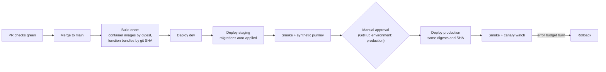

# Infrastructure and CI/CD plan

| | |
|---|---|
| Owner | Claude Code (backend, infra, backend CI). Kimi Code owns app builds, store distribution, web deploys and `frontend-ci.yaml` |
| Date | 2026-09-16 |
| Status | Phase 1 draft. Nothing here is provisioned yet; Phase 2 builds it |
| Inputs | spec `architecture` (environments, components), `agent_claude_code.ci_cd` + `repo_setup`, `agent_kimi_code.ci_cd`; ADR-0006, 0007, 0008, 0012; [architecture-c4.md](architecture-c4.md) deployment view; [threat-model.md](threat-model.md); cost model; runbooks RB-01…RB-13 |

## 1. Environments

Four tiers. Each cloud tier is a **separate** Supabase project, GCP project and vendor account set, so a credential leak or a bad migration in one cannot touch another (spec: separate Supabase projects; migrations via CLI only; seed data for dev and staging only).

| | Local | Dev | Staging | Production |
|---|---|---|---|---|
| Purpose | One engineer or agent | Shared integration, Kimi's first real-backend runs at M9 | Release candidate, prod-like; load and security tests | Users |
| Supabase | CLI local stack (Docker) | Project `suskii-dev` | Project `suskii-staging` | Project `suskii-prod` |
| Region | — | EU, same as prod (ADR-0008) | Same as prod | EU, London provisional (ADR-0008, OD-15) |
| Plan [A, cost model] | — | Free or Pro | Pro | Pro → Team (SOC 2 report, backups) → Enterprise at ~1M MAU (Realtime quota) |
| GCP project | Emulated / fakes | `suskii-dev` | `suskii-staging` | `suskii-prod` |
| Data | Seed | Seed + synthetic | Synthetic only, **never a copy of production** | Real |
| Payments, KYC, SMS | Fakes | Vendor **sandboxes** | Vendor sandboxes | Live keys |
| LiveKit | Local server or dev project | Dev project | Staging project | Production project |
| Deploys | — | Every merge to `main` | Every merge to `main`, after dev succeeds | Manual approval of an artifact already on staging |
| PITR | — | No | No | **Yes** |

**Local constraint found in Phase 0:** this development machine has no working Docker, so the Supabase local stack cannot run here; spikes used portable PostgreSQL + PostGIS instead (`spikes/postgres/setup-local-windows.sh`). CI runners (`ubuntu-latest`) have Docker, so CI runs the real local stack. For backend work on this machine, the dev Supabase project stands in for the local stack.

**Preview environments per PR** (spec asks this for the web apps) are Kimi's for the web front ends. For the database, Supabase Branching could give a throwaway project per PR [S — plan requirements and cost unverified, VERIFY-IN-RESEARCH]; until verified, PR checks use the CI local stack.

## 2. Repository layout (backend side)

Per spec `repo_setup.layout`:

```
supabase/
  config.toml
  migrations/            # timestamped SQL, CLI only
  functions/             # Deno Edge Functions, one dir each; _shared/
  tests/                 # pgTAP: rls/, functions/, state_machines/, ledger/
  seed/                  # dev + staging only
services/
  ai/                    # FastAPI, uv; prompts/, evals/, tools/
  voice-agent/           # LiveKit Agents worker, uv
  workers/               # payouts, reconciliation, exports, backfills
contracts/               # openapi/, rpc/, events/, errors/, fixtures/, generated/ (Dart + TS types)
infra/
  terraform/
    modules/             # cloud_run_service, secret, bq_dataset, wif, alert_policy
    envs/{dev,staging,prod}/
  cloudflare/            # zones, WAF rules, Access apps (Terraform)
.github/workflows/       # backend-*.yaml (Claude); frontend-ci.yaml (Kimi)
```

**Tooling:** Supabase CLI pinned in CI; `uv` for Python; Deno for Edge Functions (its own fmt/lint/test, so Edge Functions are not a pnpm workspace member); pnpm + Turborepo for the Next.js apps (Kimi); Melos for Dart (Kimi). A root `pre-commit` config runs `gitleaks`, `ruff`, `deno fmt --check`, `sqlfluff` (Postgres dialect) and `terraform fmt`.

## 3. Infrastructure as code

| Target | Tool | Scope |
|---|---|---|
| **GCP** | Terraform (`hashicorp/google`) | Projects' APIs, Artifact Registry, Cloud Run services and jobs, service accounts, **Workload Identity Federation for GitHub OIDC**, Secret Manager secrets (not values), BigQuery datasets (EU), Cloud Scheduler, Pub/Sub if needed, uptime checks, alert policies, budgets |
| **Cloudflare** | Terraform (`cloudflare/cloudflare`) | DNS, WAF custom rules and rate limits, Turnstile widgets, Access application + policies for the admin dashboard |
| **Supabase** | Supabase CLI for schema, functions, secrets; project settings via the Supabase Terraform provider **if** it covers what we need [S — VERIFY-IN-RESEARCH], otherwise a checked-in `supabase/config.toml` plus a documented Management API script | Auth settings, hooks, SMTP, rate limits, network restrictions, API exposure of schemas |
| **Sentry** | Terraform provider (community) [S] or manual with a checklist | Projects, alert rules, data scrubbing rules |
| **LiveKit, gateways, Smile ID, SMS vendors** | Manual, recorded in `infra/vendor-accounts.md` (no secrets) | Webhook URLs, allowed IPs, keys issued per environment |

Terraform state lives in a versioned GCS bucket in the EU, one state per environment, with the bucket in a separate `suskii-ops` project that only the CI deploy identity and two named humans can write.

## 4. Secrets and identity

| Secret class | Lives in | Reaches runtime by | Rotation |
|---|---|---|---|
| GitHub → GCP deploy auth | **No key**: GitHub OIDC → Workload Identity Federation, one deploy service account per environment, scoped to that project | OIDC token per job | Nothing to rotate |
| Supabase access token + DB password for CI deploys | GitHub **environment** secrets (`staging`, `production`) | CI job in that environment only | RB-10, 90 days |
| Vendor API keys used by Edge Functions (gateways, Smile ID, LiveKit, SMS, push) | GCP Secret Manager (source of truth) | CI copies into Edge Function secrets at deploy (`supabase secrets set`) | RB-10 |
| Vendor keys used by Cloud Run | Secret Manager | Mounted as secret env vars by revision | RB-10; new revision picks them up |
| Database-side secrets (webhook signing, envelope-encryption key references, `pg_net` callback tokens) | **Supabase Vault** (ADR-0007) | `vault.decrypted_secrets` inside `SECURITY DEFINER` functions only | RB-10 |
| Supabase **service role** key | Secret Manager; used only by workers that genuinely need it (never the AI service for user tools, ADR-0012) | Secret env var | RB-10 |
| Client configuration | Public: Supabase URL, publishable (anon) key, Sentry DSN, PostHog key, Turnstile site key | Build-time config per flavor (Kimi) | — |

**Guardrails in CI:** `gitleaks` on every push and PR; a check that fails if a string matching the service role JWT shape or any `sk_live`/`FLWSECK` prefix appears anywhere outside Secret Manager references; Edge Functions and Cloud Run read secrets by name only.

## 5. Continuous integration

Backend workflows use **path filters** so they never run on Kimi's changes and never collide with `frontend-ci.yaml`, which stays Kimi's and unedited. Every job pins action versions by SHA.

| Workflow | Triggers (paths) | Jobs | Blocking on PR |
|---|---|---|---|
| `backend-db.yaml` | `supabase/migrations/**`, `supabase/tests/**`, `supabase/seed/**`, `supabase/config.toml` | Start the CLI local stack → `supabase db reset` (all migrations + seed from zero) → **pgTAP** (`supabase test db`) → `supabase db lint` → migration safety lint (`squawk` [S]) → **Supabase security and performance advisors** against the local stack [VERIFY-IN-RESEARCH: CLI or Management API command] → generate types and **fail on drift** against `contracts/generated/` | Yes |
| `backend-functions.yaml` | `supabase/functions/**`, `contracts/**` | `deno fmt --check`, `deno lint`, `deno check`, `deno test` with mocked vendors; **contract tests** against `contracts/openapi` using the fixtures; webhook signature tests with vendor sample payloads | Yes |
| `services-ai.yaml` | `services/ai/**`, `services/voice-agent/**` | `uv sync --frozen`, `ruff`, `pyright`, `pytest` with the fake LLM gateway; allowlist test (ADR-0012: generated DB client exposes only allowlisted functions); **fast eval subset** against Vertex via WIF (same-repo PRs only; forks skip) with cost and latency regression check ([ai-design.md](ai-design.md) §8.3); container build | Yes |
| `services-workers.yaml` | `services/workers/**` | Lint, types, tests, container build | Yes |
| `contracts.yaml` | `contracts/**` | Validate OpenAPI and JSON Schemas; validate every fixture against its schema; **breaking-change detection** between the PR and `main` (`oasdiff` [S]) that requires a major version bump and a `HANDOFF.md` migration note; `CHANGELOG.md` entry present | Yes |
| `security.yaml` | All pushes and PRs; nightly | CodeQL (Python, JS/TS), Semgrep (`p/owasp-top-ten`, `p/secrets` + custom rules: no `SECURITY DEFINER` without `SET search_path = ''`, no `float`/`numeric` money columns, no `service_role` in `apps/`), dependency review, `osv-scanner` on lockfiles, **ADR-0010 banned-package check** on Dart and npm lockfiles | Yes (high and critical) |
| `infra.yaml` | `infra/**` | `terraform fmt -check`, `validate`, `tflint`, `plan` for each env posted to the PR | Yes |
| `nightly.yaml` | Schedule | Full eval suites; OWASP ZAP baseline against staging web and function endpoints; restore-test of last night's logical backup into a scratch database (§8) | Alerts, opens an issue |
| `load.yaml` | Manual + weekly | k6 against staging ([test-strategy.md](test-strategy.md) §5) | Alerts |

**Branch protection on `main`:** required checks = the blocking jobs above plus Kimi's `frontend-ci` jobs for their paths; linear history; no force pushes. Both agents currently push as the same GitHub user, so `CODEOWNERS` cannot enforce review between them; ownership is enforced by path filters, the drift check and the audit instead.

**The contract drift check binds both sides.** Claude generates Dart and TypeScript types into `contracts/generated/` from the database and OpenAPI. If a migration changes a type without regenerating, `backend-db` fails; if Kimi's apps stop compiling against the committed generated types, `frontend-ci` fails. Neither agent can drift silently.

## 6. Continuous delivery

### 6.1 Pipeline



Spec rules this implements: migrations applied to staging automatically after merge; production requires manual approval; Edge Functions and Cloud Run deployed per environment with rollback.

**Promote, don't rebuild.** Production receives the exact image digests and function bundle SHA that passed staging.

**Approval gate caveat:** the repository is **private**. GitHub environment *required reviewers* on private repositories need a paid GitHub plan (Team or Enterprise) [S — VERIFY-IN-RESEARCH]. If the account stays on a plan without it, the fallback is a `workflow_dispatch`-only production workflow restricted to named actors plus a signed release tag. Client decision, low cost — raised in §11.

### 6.2 Order of operations per release

1. **Database expand** migrations (additive only).
2. **Edge Functions** and **Cloud Run** services that work with both old and new schema.
3. Remote config and feature flags (default off).
4. Clients (Kimi) ship through staged rollout.
5. **Database contract** migrations only once `min_supported_app_version` in bootstrap (Kimi's `AppBootstrap.minSupportedAppVersion`) is above every client that used the old shape, and never in the same release as the expand.

### 6.3 Migration rules (expand/contract, zero downtime)

| Rule | Why |
|---|---|
| Every migration sets `lock_timeout` (e.g. 3 s) and `statement_timeout` | A blocked `ALTER` must fail fast, not queue every request behind it |
| New columns nullable or with a constant default; `NOT NULL` added later via `CHECK … NOT VALID` then `VALIDATE` | Avoids a table rewrite and long locks |
| Indexes on existing large tables built `CONCURRENTLY` in their own migration outside a transaction [VERIFY-IN-RESEARCH: how the Supabase CLI wraps migrations] | Avoids write locks |
| Backfills run as batched worker jobs, not inside migrations | Keeps migrations short and restartable |
| Renames are add-new → dual-write → backfill → switch reads → drop old, across releases | Old clients keep working |
| Destructive changes (drop column, table, enum value) only in a contract release | Rollback stays possible |
| No rollback migrations; fixes go forward. PITR is the last resort (RB-09) | Down-migrations are rarely tested and often lose data |
| RLS, grants and function `SECURITY` settings change in the same migration as the table they protect, with pgTAP tests in the same PR | S-13: a table exposed for one deploy without policies is a breach |
| Partition maintenance (`pg_partman`) is config, not ad-hoc migrations | Monthly partitions from the ERD |

### 6.4 Deploy and rollback per component

| Component | Deploy | Canary | Rollback |
|---|---|---|---|
| Postgres schema | `supabase db push` to staging on merge; to prod on approval, after confirming a fresh PITR point | — | Forward-fix migration; PITR restore per RB-09 for data damage |
| Edge Functions | `supabase functions deploy` per function, bundle tagged with git SHA | Feature flag inside the function where the change is risky | Redeploy the previous SHA (one command, scripted) |
| AI service, workers | Cloud Run new revision by digest, `--no-traffic` | 10% for 30 min watching error rate, p95 latency and AI cost, then 100% | Shift traffic to the previous revision |
| Voice agent | Where it runs is decided by S-08: Cloud Run (long-lived WebSocket workers need CPU always allocated and min instances) or LiveKit's agent hosting [S — VERIFY-IN-RESEARCH] | Drain: new sessions to the new version, existing sessions finish | Redeploy previous version |
| Remote config, model routes, feature flags | Admin or CI write to `remote_config` / `feature_flags` tables, audited | Per-country rollout percentage | Flip back (RB-11 for model routes, RB-13 kill switch) |
| Mobile apps (Kimi) | Codemagic or Fastlane → internal testing → staged store rollout | Gated on crash-free sessions ≥ 99.5% (spec) | Halt rollout; force update via `min_supported_app_version` (RB-13) |
| Web apps (Kimi) | Hosting target not decided — see §11 | Preview per PR | Previous deployment |

## 7. Observability

| Signal | Tooling | Owner |
|---|---|---|
| Errors and traces | Sentry: separate projects for mobile, each web app, Edge Functions, AI service, voice agent, workers; environments tagged; **scrubbing rules for the data classes G, B, C, F and access notes** tested in CI with seeded canaries (data-flow rule 3) | Both |
| Database and platform logs | Supabase logs; **log drain** to Cloud Logging or Sentry [A — log drains are plan-gated; confirm plan] | Claude |
| Cloud Run logs and metrics | Cloud Logging + Cloud Monitoring | Claude |
| Uptime and synthetic journeys | Cloud Monitoring uptime checks on public endpoints; a **synthetic journey on staging every 15 min**: sign in (test OTP) → create and publish request → provider offer → accept → sandbox payment → cancel | Claude |
| Product analytics | PostHog EU (Kimi instruments; pseudonymous ids) | Kimi |
| Business and cost dashboards | BigQuery + Looker Studio or Metabase | Claude |

**SLOs** (spec `performance_targets`):

| SLO | Target | Measured at | Alert |
|---|---|---|---|
| Core-flow availability (sign in, publish, offer, accept, pay, track, complete) | 99.9% monthly | Synthetic journey + server error rate on those RPCs | Error budget burn 2% in 1 h or 5% in 6 h |
| RPC latency | p95 ≤ 300 ms | PostgREST / function timings | p95 > 300 ms for 15 min |
| Nearest-provider query | p95 ≤ 50 ms | Function timing (S-06 baseline: pass at calibrated load) | p95 > 50 ms for 15 min |
| Realtime event delivery | p95 ≤ 1 s | Synthetic publisher/subscriber pair | p95 > 1 s for 10 min |
| Webhook processing | 99% within 60 s of receipt | `webhook_events.received_at → processed_at` | Backlog > 100 or oldest > 5 min (RB-02) |
| `provider_live_location` dead-tuple ratio | < 20% (ADR-0009 condition) | `pg_stat_user_tables` exported every minute | > 20% for 10 min (RB-12) |
| Ledger zero-sum and reconciliation | 0 unbalanced transactions; daily reconciliation matches | Nightly check job | Any mismatch pages Finance on-call (RB-03) |

Alert routing, severity ladder and on-call follow RB-01.

## 8. Backups and disaster recovery

| Control | Setting | Target |
|---|---|---|
| Point-in-time recovery | Enabled on production | **RPO ≤ 5 min** [A — confirm PITR granularity on the chosen plan] |
| Daily logical backup | Worker runs `pg_dump` of the production database to an EU GCS bucket with object versioning, CMEK and a retention lock; excludes nothing that PITR covers | Survives loss of the Supabase project or account |
| Storage buckets | Nightly sync of private buckets to EU GCS; `kyc-docs` synced to a separate bucket with narrower access | Same |
| Restore drill | Nightly automated restore of the logical backup into a scratch database with row-count and ledger-balance checks; quarterly full drill per RB-09 | **RTO ≤ 4 h** [A] |
| Configuration | Terraform state, `config.toml`, migrations and remote-config exports in git or versioned buckets | Rebuild a project from code |

Retention of backups follows the DPIA: backups older than the longest retention of the data they contain are deleted, and account-deletion requests are honoured on restore by replaying the deletion log.

## 9. Cost and quota guards

- GCP budget alerts per project at 50/80/100% of monthly budget; separate alert on Vertex spend (ai-design §6.5).
- Supabase spend cap **off** in production (a cap that suspends the service breaks the 99.9% SLO) with usage alerts instead; **on** in dev.
- Realtime connection and message quotas watched against plan limits (RB-12); the cost model shows peak connections exceed the Team plan's limit before 1M MAU.
- OTP spend per hour alert (R-31).

## 10. Coexisting with Kimi Code

| Area | Rule |
|---|---|
| `frontend-ci.yaml` | Kimi's; Claude never edits it. Backend workflows use disjoint path filters |
| Generated types | Claude writes `contracts/generated/`; Kimi consumes them read-only. Drift fails CI |
| Client config | Claude publishes per-environment public config (URL, publishable key, Turnstile site key, Sentry DSNs) in `contracts/environments.md`; Kimi wires flavors to it |
| Mock → real switch (M9) | Kimi points the dev flavor at `suskii-dev` once Stage B contracts and the Phase 2 foundation exist |
| Store builds, signing, distribution, web hosting | Kimi's (spec `agent_kimi_code.ci_cd`); Claude reviews in the audit |

## 11. Open items

| # | Item | Owner | Needed by |
|---|---|---|---|
| I-1 | **GitHub plan** for production approval gates on a private repo (§6.1) | Client | Phase 2 |
| I-2 | **Web hosting** for the three Next.js apps: e.g. Vercel, or Cloudflare (already in the stack for WAF and Access) via OpenNext [S]. Kimi proposes, Claude reviews for Access, WAF and residency | Kimi + client | Before M9 |
| I-3 | Supabase plan per environment and whether Branching and log drains are included [VERIFY-IN-RESEARCH] | Claude | Phase 2 |
| I-4 | Voice agent hosting: Cloud Run vs LiveKit-hosted agents | Claude, via S-08 | Phase 7 |
| I-5 | How the Supabase CLI wraps migrations in transactions (affects `CREATE INDEX CONCURRENTLY`) [VERIFY-IN-RESEARCH] | Claude | Phase 2 |
| I-6 | Advisors in CI: exact CLI or Management API command [VERIFY-IN-RESEARCH] | Claude | Phase 2 |
| I-7 | GCP billing (also blocks S-07) and organisation/project structure under the client's account | Client | Phase 2 |
