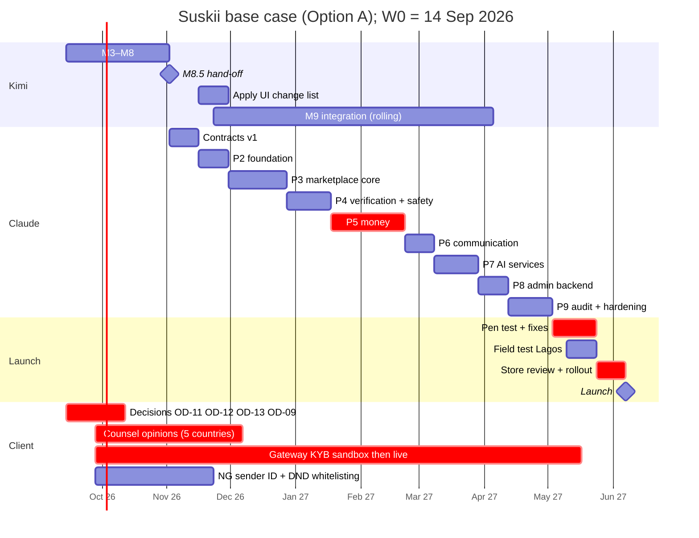
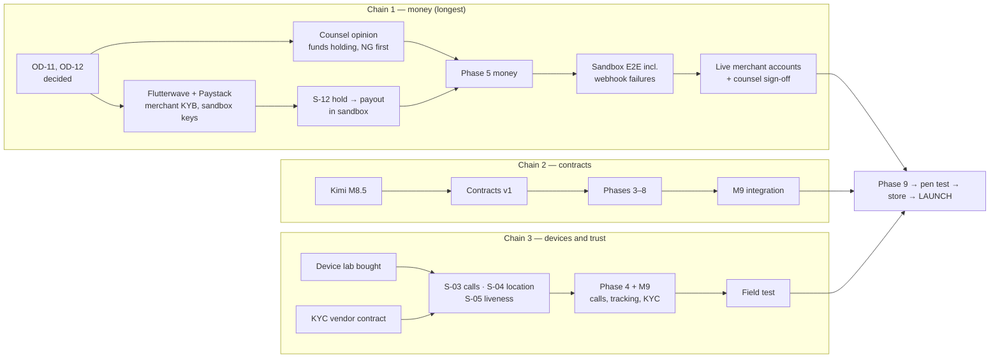

# Revised timeline — single full release

| | |
|---|---|
| Owner | Claude Code (technical lead) |
| Date | 2026-09-16 |
| Status | Phase 1 draft (deliverable #13). Re-baselined at M8.5, at contracts v1, and at every phase checkpoint |
| Inputs | spec `agent_routing.sequence`, `agent_claude_code.phases`, `agent_kimi_code.milestones`, `workflow_with_kimi_code`; [PHASE-1-PLAN.md](PHASE-1-PLAN.md); spike plan and status; [OPEN-DECISIONS.md](../OPEN-DECISIONS.md); risk register; REPORT §3, §5, §6, §10; [infra-cicd.md](infra-cicd.md); [test-strategy.md](test-strategy.md) |

## 1. What this timeline is, and why it is "revised"

The spec sets an order, not dates: Kimi builds the whole UI on mocks → Claude publishes contracts v1 → Claude builds the backend while Kimi aligns → Kimi swaps mocks for the real backend → audit and hardening → device testing, store submission, launch. The release is **everything at once** (client decision).

Two things observed since Phase 0 change the plan:

1. **The agents are fast; the outside world is not.** Kimi finished M1, M2 and the M3 foundation within days, and Claude finished Phase 0 and Stage A of Phase 1 in the same window. Coding time is no longer the constraint. The launch date is set by **vendor contracts, merchant onboarding, legal opinions, physical devices, native-speaker data, external penetration testing and store review** — none of which an agent can accelerate.
2. **Most external work has not started.** GCP billing is closed (S-07 blocked), there is no Supabase project (S-02, S-11), no gateway sandbox credentials (S-12), no device lab (S-03…S-05), no SMS accounts or Nigerian sender ID (S-09), and none of the client decisions are answered (OD-01…OD-21).

So the schedule below is built backwards from external lead times, and the most useful part of it is the **client action list** (§5).

**All durations are estimates `[A]`** unless tagged otherwise. Weeks are counted from **W0 = week of Monday 14 September 2026**.

## 2. Workstreams

| Stream | Owner | Moves at the speed of |
|---|---|---|
| Frontend M3 → M8.5 → M9 | Kimi Code | Agent pace; review cycles with Claude |
| Contracts v1 (Stage B) | Claude Code | Kimi's M8.5 hand-off |
| Backend Phases 2 → 8 | Claude Code | Accounts and sandboxes existing; spike results |
| Audit, hardening, launch (Phases 9–10) | Claude Code + Kimi Code | External pen test, field test, store review |
| Spikes | Claude Code + Kimi Code | Credentials and devices |
| **Client and counsel** | Client | Decisions, contracts, registrations, purchases |

## 3. Schedule (base case)

| # | Milestone | Owner | Depends on | Base weeks | Slip range | Base dates |
|---|---|---|---|---|---|---|
| 1 | M3 requests, concierge UI, offers | Kimi | M2 ✅ | W0–W1 | — | 14–27 Sep 2026 |
| 2 | M4 payments UI, tracking, chat, calls, SOS, completion | Kimi | M3 | W2 | +1 wk | 28 Sep–4 Oct |
| 3 | M5 wallet, earnings, withdrawals, referrals, promos, disputes, support, settings, deletion | Kimi | M4 | W3 | +1 wk | 5–11 Oct |
| 4 | M6 provider tools, business console | Kimi | M5 | W4 | +1 wk | 12–18 Oct |
| 5 | M7 customer web app, marketing site | Kimi | M1 design system | W5 | +1 wk | 19–25 Oct |
| 6 | M8 admin dashboard | Kimi | M1 | W6 | +1 wk | 26 Oct–1 Nov |
| 7 | **M8.5 hand-off**: final draft, demo APK + TestFlight + web previews | Kimi | M3–M8; **Apple and Google developer accounts** for TestFlight | **W7** | W5–W10 | ~2 Nov 2026 |
| 8 | **Contracts v1** + fixtures + UI change list (Stage B) | Claude | M8.5; Stage A ✅ | W7–W8 | +3 wk | 2–15 Nov |
| 9 | Kimi applies UI change list, aligns models | Kimi | Contracts v1 | W9–W10 | +2 wk | 16–29 Nov |
| 10 | Phase 2 backend foundation: projects, auth + hooks, schemas, audit, outbox, integrity, observability | Claude | Supabase + GCP accounts **with billing**; contracts v1 under Option A only (§6) | W9–W10 | Option B: W1–W4 | 16–29 Nov |
| 11 | Phase 3 marketplace core: taxonomy, requests, matching, offers, state machine, realtime, chat, business | Claude | Phase 2; contracts v1; S-02, S-11 | W11–W14 | +2 wk | 30 Nov–27 Dec |
| 12 | Phase 4 verification and safety: KYC vendor, police clearance, selfie checks, officer queue, SOS | Claude | Phase 3; **KYC vendor sandbox + contract**; S-05; **SOS partner API** in Lagos | W15–W17 | +3 wk | 28 Dec–17 Jan 2027 |
| 13 | Phase 5 money: gateways, ledger, holds, settlement, payouts, refunds, promos, tips, referrals, reconciliation | Claude | Phase 3; **gateway sandboxes**; S-12; **OD-11, OD-12** answered | W18–W22 | +3 wk | 18 Jan–21 Feb |
| 14 | Phase 6 communication: LiveKit tokens, VoIP push, PSTN fallback, notifications, scheduled errands | Claude | Phase 3; **LiveKit + telephony accounts**; S-03 | W23–W24 | +2 wk | 22 Feb–7 Mar |
| 15 | Phase 7 AI services: gateway, concierge tools, voice agent, pricing, matching, moderation, receipts, admin assistant, evals | Claude | Phase 3; **GCP billing**; S-07, S-08; **OD-17, OD-20** | W25–W27 | +3 wk | 8–28 Mar |
| 16 | Phase 8 admin backend and analytics | Claude | Phases 3–5 | W28–W29 | +2 wk | 29 Mar–11 Apr |
| 17 | M9 module-by-module integration with the real backend | Kimi | Each backend phase as it lands | W11–W30 | tracks rows 11–16 | 30 Nov–18 Apr |
| 18 | Phase 9 audit, bug fixing, hardening | Claude + Kimi | Phases 2–8, M9 | W30–W32 | +2 wk | 12 Apr–2 May |
| 19 | Target-scale load test | Claude | Phase 9; upsized staging | W32 | +1 wk | 26 Apr–2 May |
| 20 | **External penetration test** + fixes | Vendor + Claude + Kimi | Phase 9; **pen-test vendor booked ~6 weeks ahead** | W33–W35 | +2 wk | 3–23 May |
| 21 | Field test in Lagos (device lab, 4 networks) | Kimi + Claude + client testers | Release candidate; **testers and SIMs** | W34–W35 | +1 wk | 10–23 May |
| 22 | **Live** merchant accounts, KYC production keys, SMS sender IDs approved, counsel sign-off for Nigeria (`live` pack) | Client | OD-12; KYB; registrations | by W34 | — | by 16 May |
| 23 | Store submission and review; staged rollout | Kimi + client | Rows 20–22; store declarations (FGS, full-screen intent, precise location, Data safety, privacy labels) | W36–W37 | +2 wk | 24 May–6 Jun |
| 24 | **Launch (Nigeria live; KE/GH/ZA/UG beta per OD-14)** | All | Everything above | **W38** | **W32–W46** | **week of 7 Jun 2027** |

**Reading the range.** The optimistic end (W32, late April 2027) needs Option B (§6), every client action in §5 started this month, and no failed spike gate. The pessimistic end (W46, early August 2027) is what happens if merchant onboarding, funds-holding legal review or the KYC contract slip by a month — each is plausible.

## 4. Critical path

Three chains decide the date. Any slip on them moves launch week for week.

| Chain | Why it is critical | Earliest honest date it clears [A] |
|---|---|---|
| **1. Money** | Nothing launches without the ability to collect, hold and pay out legally. Needs a client decision, counsel in Nigeria, gateway KYB for the Suskii entity, then a sandbox integration and a live switch. Merchant onboarding and legal opinions each commonly take several weeks | W22 for sandbox-complete Phase 5; W34 for live accounts + sign-off |
| **2. Contracts** | The spec forbids building the backend or wiring the UI before contracts v1, and contracts v1 needs M8.5 | W8 (contracts v1 published) |
| **3. Devices and trust** | Calls with the app killed, background location on Tecno/Infinix/itel and liveness on 2 GB RAM can only be proven on physical phones; a failed gate means a different plugin, SDK version or vendor | S-03…S-05 need ~3 weeks after devices arrive (spike plan: 5 + 5 + 3 days, partly parallel) |

**Near-critical** (float of 2–4 weeks): KYC vendor contract (blocks Phase 4), GCP billing and Pidgin speakers (block S-07/S-08 and Phase 7), NG sender ID and DND whitelisting (blocks reliable OTP in Nigeria, S-09; R-17), SOS partner in Lagos (blocks the SOS story SH-24 from being real), pen-test vendor booking.

## 5. Client action list — what unblocks what, and by when

Ordered by the week it must be **started** to hold the base case.

| # | Action | Unblocks | Start by | Done by | Lead time basis |
|---|---|---|---|---|---|
| 1 | **Reopen a GCP billing account** and create the Suskii GCP organisation/projects | S-07, Phase 2 (Option B), Phase 7 | **W0** | W1 | Minutes to days [A] |
| 2 | **Decide OD-11, OD-12, OD-13, OD-09** (and confirm Proposed defaults for the rest, or say which to change) | Contracts v1, Phase 4, Phase 5 | **W0** | W4 | Client |
| 3 | **Engage counsel in Nigeria first** (then KE, GH, ZA, UG) on funds holding, data protection registration, consumer and platform-worker rules | Chain 1; NG `live` pack | **W0** | W10 (NG) | Legal opinions: several weeks [A] |
| 4 | **Apply for Flutterwave and Paystack merchant accounts** for the operating entity; get sandbox keys immediately | S-12, Phase 5 | **W0** | Sandbox W2; live W34 | KYB review: weeks [A] |
| 5 | **Start Nigerian sender-ID registration and DND whitelisting**; open SMS accounts (Termii, Africa's Talking, Infobip per vendor matrix) | S-09, reliable OTP | **W0** | W8 | "Takes weeks" [S] (REPORT §6) |
| 6 | **Buy the device lab** (~9 phones, test-strategy §6) and local SIMs | S-03, S-04, S-05; field test | **W1** | W3 | Purchase and shipping [A] |
| 7 | **Smile ID contract** (volume + SmartSelfie authentication pricing, OD-13) and sandbox | S-05, Phase 4 | **W1** | W8 | Sales cycle [A] |
| 8 | **Create a Supabase organisation** (plan per infra-cicd §1) and confirm region (ADR-0008, OD-15) | S-02, S-11, Phase 2 | **W1** | W2 | Minutes [A]; region choice needs S-01 from an African vantage point |
| 9 | **Apple Developer (organisation) and Google Play Console** accounts for the entity | M8.5 TestFlight, store submission | **W1** | W4 | Organisation enrolment needs a D-U-N-S number and verification; can take weeks [A] |
| 10 | **Recruit native Pidgin speakers** (OD-20) with consent and pay | S-07 Pidgin half, S-08 | W2 | W6 | Recruitment [A] |
| 11 | **LiveKit Cloud** account and a **telephony provider** for masked calls per country | S-01 media, S-03, S-08, Phase 6 | W2 | W6 | Sales for plan and number masking [A] |
| 12 | **SOS partner in Lagos** (and AURA / Rescue.co for later countries) with API or dispatch console access | SH-24 end to end, Phase 4 | W4 | W16 | Partnership contract [A] |
| 13 | **Decide GitHub plan** for production approval gates on the private repo (infra I-1) | Phase 2 CI/CD | W6 | W8 | Minutes [S] |
| 14 | **Book an external penetration test** | Phase 10 | W24 | test at W33 | Vendor scheduling ~6 weeks [A] |
| 15 | **Recruit field testers** in Lagos across MTN, Airtel, Glo, 9mobile | Field test | W28 | W32 | [A] |
| 16 | **Store listing assets, privacy policy, terms per country** approved by counsel | Store submission | W26 | W34 | [A] |

## 6. Decision for the user: start the backend foundation before M8.5?

The spec's sequence has Claude start the backend after contracts v1 (Option A). **Phase 2 is different from Phases 3–8**: projects, environments, CI/CD, auth hooks, schemas, the audit log, the outbox and observability do not depend on any screen or contract content. Everything in it is already specified by Stage A (ERD, RLS matrix, infra plan, threat model).

| | Option A — spec order | **Option B — foundation now (recommended)** |
|---|---|---|
| Phase 2 | W9–W10, after contracts v1 | W1–W4, alongside Kimi's M3–M8 |
| Effect on launch | Base case W38 | About **2 weeks earlier** (Phase 3 starts the moment contracts v1 lands) and **spikes S-02 and S-11 run on the real project** instead of waiting |
| Risk | None new | Low: foundation work is reversible, and no application tables or functions that contracts v1 would define are created before it |
| Prerequisites | — | Client actions 1 and 8 (GCP billing, Supabase organisation) |

**Decided 2026-09-16: Option B, approved by the user** ([ADR-0013](../adr/0013-backend-foundation-before-contracts-v1.md)). Phase 2 foundation started the same day. The §3 table keeps the Option A base case until the next re-baseline at M8.5, when the ~2-week gain is applied if Phase 3 does start on contracts v1 publication.

## 7. Fixed external dates inside the window

| Date | What | Impact | Source |
|---|---|---|---|
| **31 Dec 2026** (W15) | Gemini 3.7/3.8 Flash promotional pricing ends | Launch-time AI cost uses standard prices; the cost model already does (ai-design §11) | [V] REPORT §9 |
| **Nov 2026** (≈W7) | Google Play precise-location declaration becomes available | Prepare the declaration during M9 | [V] REPORT §10 |
| **27 Jan 2027** (W19) | Precise-location declaration **enforced** | Must be in place before store submission (W36) — so it applies to launch | [V] REPORT §10 |
| Annually [S] | Google Play target-API-level requirement moves | Check the requirement in force at W36 and set `targetSdk` accordingly | Check at Phase 10 |
| Ongoing | Gemini deprecations with as little as 2 weeks' notice | Model IDs in remote config; evals gate swaps (ADR-0006, RB-11) | [V] REPORT §9 |

## 8. Schedule risks

| Risk | Effect on dates | Mitigation already in the plan | Register |
|---|---|---|---|
| Funds-holding model rejected by counsel in Nigeria | Chain 1 slips; possibly a different collection model | Start counsel at W0; ADR-0002 designed around gateway-supported mechanisms only | OD-12, R-01 |
| Pidgin voice fails S-08 | None if accepted: Pidgin ships as text | Gate and fallback designed in (OD-17) | R-03 |
| KYC cost or SDK stability on 2 GB phones | Phase 4 rework, possible vendor switch | S-05 early; IdentityVerificationProvider abstraction; OD-13 | R-04, R-10 |
| Background location killed by OEM battery managers | Provider tracking redesign or commercial plugin | S-04 early; ADR-0009 movement-gated heartbeat | R-09 |
| VoIP calls unreliable with app killed | PSTN fallback becomes primary on some devices | S-03 early; SH-14 fallback | R-08 |
| Kimi's M8.5 slips | Chain 2 slips week for week | Stage A done early; Option B keeps backend foundation moving | — |
| Pen test finds critical issues | +2–4 weeks | Continuous Semgrep/CodeQL/ZAP, pgTAP deny tests, audits at each milestone | — |
| Store rejection (VoIP, FGS, location, financial features) | +1–3 weeks per round | Declarations prepared during M9; store readiness checklist (PRD N-13) | — |

## 9. Re-baseline points

This timeline is updated, with the date and reason, at: M8.5; contracts v1 publication; each of S-03, S-05, S-07, S-08 and S-12 finishing; every answered OD that changes scope (OD-11, OD-12, OD-13, OD-14, OD-17); and every phase checkpoint. Superseded versions stay in git history; the table in §3 always shows the current baseline.
